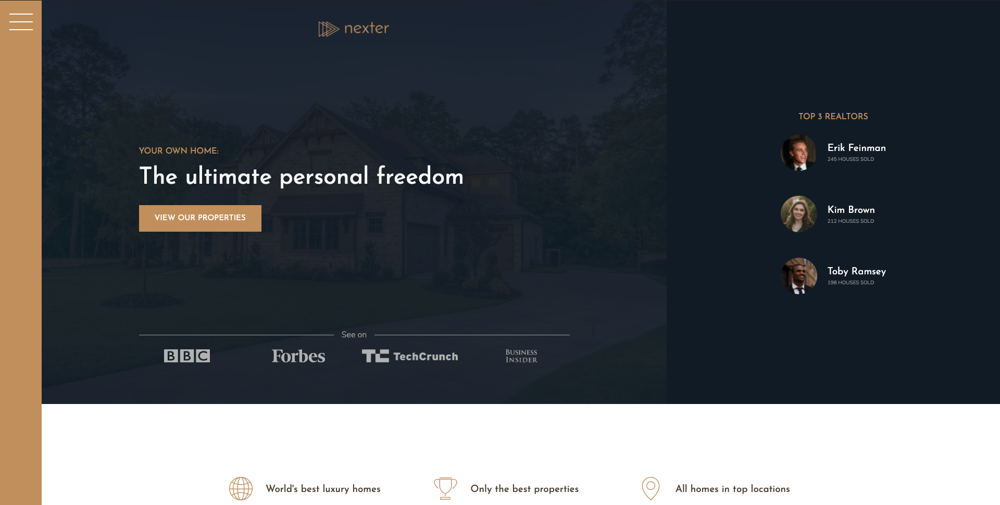
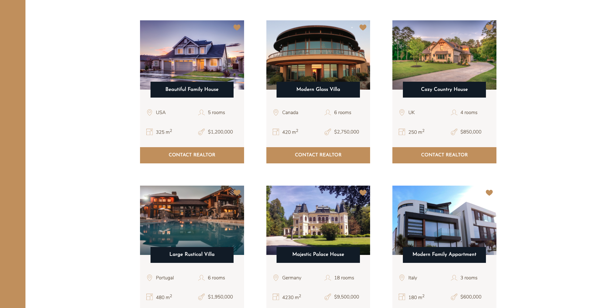
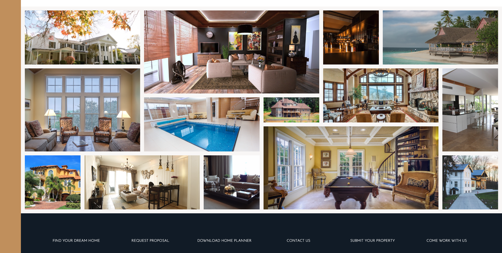

# Nexter 🏠

This is my first look and experiments with CSS Grid ⌗.

This a simple landing page of a fictional company called Nexter that sells luxury homes. 

This project contains only the landing page with a title screen, top 3 realtors, values of the company, different housing options, picture gallery and a footer. Note that all of these features have no real functionality other than animations, the goal in this project was to simply play around with CSS Grids. 

The layout used is, of course, CSS Grid, with a few Flexbox containers in the mix.

> Original project and design guidelines credited to [Jonas Schemedtmann](https://codingheroes.io/) from his [Udemy course](https://www.udemy.com/course/advanced-css-and-sass/).
